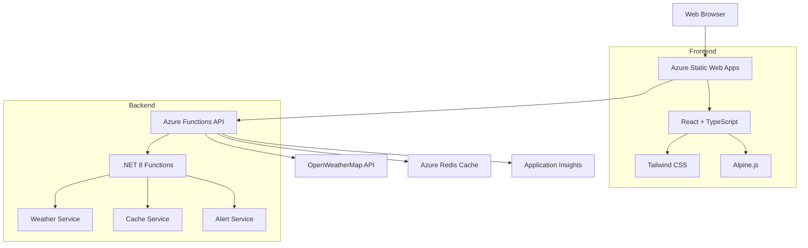

# 🌤️ SkySense - Weather Dashboard

> Real-time weather intelligence with beautiful visualizations and smart alerts

[](https://azure.microsoft.com/services/app-service/static/)
[](https://azure.microsoft.com/services/functions/)
[](https://dotnet.microsoft.com/)
[](https://reactjs.org/)
[](https://tailwindcss.com/)

## ✨ Features

🌍 **Global Weather Data** - Get real-time weather for any city worldwide  
📊 **Interactive Forecasts** - 7-day detailed forecasts with hourly breakdown  
⚡ **Smart Alerts** - Intelligent weather warnings and notifications  
📱 **Responsive Design** - Beautiful UI that works on all devices  
🎯 **Auto-Location** - Automatic weather detection for your current location  
💾 **Smart Caching** - Fast performance with Redis caching  
🔄 **Real-time Updates** - Live data refresh every 15 minutes  
🎨 **Dynamic Themes** - Weather-adaptive UI themes and animations  

## 🚀 Live Demo

🔗 **[View Live Demo](https://your-static-web-app.azurestaticapps.net)**

## 📸 Screenshots

<div align="center">
  
  
</div>

## 🛠️ Tech Stack

### Frontend
- **React 18.3** - Modern UI framework with hooks
- **TypeScript 5.6** - Type-safe development
- **Tailwind CSS 3.4** - Utility-first styling
- **Alpine.js 3.14** - Lightweight interactivity
- **Vite 5.4** - Lightning-fast build tool
- **Lucide React** - Beautiful icon system

### Backend
- **.NET 8.0** - High-performance runtime
- **Azure Functions v4** - Serverless compute
- **OpenWeatherMap API** - Real-time weather data
- **Redis Cache** - High-speed data caching
- **Application Insights** - Performance monitoring

### Infrastructure
- **Azure Static Web Apps** - Frontend hosting
- **Azure Function Apps** - API backend
- **Azure Cache for Redis** - Data caching layer
- **GitHub Actions** - CI/CD pipeline

## 🏗️ Architecture



## 🚀 Getting Started

### Prerequisites

- **Node.js 18+** and npm
- **.NET 8.0 SDK**
- **Azure Functions Core Tools**
- **Azure CLI** (for deployment)
- **OpenWeatherMap API Key** (free tier available)

### Quick Start

1. **Clone the repository**
   ```bash
   git clone https://github.com/your-username/weather-dashboard.git
   cd weather-dashboard
   ```

2. **Setup Backend**
   ```bash
   cd src/WeatherDashboard.Functions
   
   # Install dependencies
   dotnet restore
   
   # Configure local settings
   cp local.settings.example.json local.settings.json
   # Add your OpenWeatherMap API key
   
   # Start the API
   func start
   ```

3. **Setup Frontend**
   ```bash
   # Install dependencies
   npm install
   
   # Configure environment
   cp .env.example .env.local
   # Set VITE_API_BASE_URL=http://localhost:7105/api
   
   # Start development server
   npm run dev
   ```

4. **Visit the app**
   Open [http://localhost:5173](http://localhost:5173)

## ⚙️ Configuration

### Environment Variables

#### Frontend (.env.local)
```env
VITE_API_BASE_URL=http://localhost:7105/api
```

#### Backend (local.settings.json)
```json
{
  "IsEncrypted": false,
  "Values": {
    "AzureWebJobsStorage": "UseDevelopmentStorage=true",
    "FUNCTIONS_WORKER_RUNTIME": "dotnet-isolated",
    "OpenWeatherMapApiKey": "your_api_key_here",
    "RedisConnectionString": "localhost:6379",
    "CacheDurationMinutes": "15"
  }
}
```

### API Keys

Get your free OpenWeatherMap API key:
1. Visit [OpenWeatherMap](https://openweathermap.org/api)
2. Sign up for a free account
3. Generate an API key
4. Add to your configuration

## 📁 Project Structure

```
weather-dashboard/
├── src/
│   ├── WeatherDashboard.Functions/     # .NET Backend API
│   │   ├── Functions/                  # HTTP Functions
│   │   ├── Services/                   # Business logic
│   │   ├── Models/                     # Data models
│   │   └── Configuration/              # App settings
│   ├── components/                     # React components
│   │   ├── Weather/                    # Weather-specific components
│   │   ├── UI/                         # Reusable UI components
│   │   └── Dashboard/                  # Dashboard sections
│   ├── hooks/                          # Custom React hooks
│   ├── services/                       # API services
│   ├── utils/                          # Utility functions
│   └── types/                          # TypeScript definitions
├── infrastructure/                     # Azure deployment
├── docs/                              # Documentation
└── public/                            # Static assets
```

## 🌐 API Documentation

### Weather Endpoints

| Endpoint | Method | Description |
|----------|--------|-------------|
| `/api/weather/{city}` | GET | Current weather by city name |
| `/api/weather-coords?lat={lat}&lon={lon}` | GET | Current weather by coordinates |
| `/api/forecast/{city}` | GET | 5-day forecast by city |
| `/api/forecast-coords?lat={lat}&lon={lon}` | GET | 5-day forecast by coordinates |
| `/api/alerts/{city}` | GET | Weather alerts for city |
| `/api/health` | GET | API health check |

### Example Response
```json
{
  "success": true,
  "message": "Weather data retrieved successfully",
  "data": {
    "name": "London",
    "main": {
      "temp": 22.5,
      "feels_like": 23.1,
      "humidity": 65
    },
    "weather": [{
      "main": "Clear",
      "description": "clear sky",
      "icon": "01d"
    }]
  },
  "timestamp": "2024-01-15T10:30:00Z"
}
```

## 🚀 Deployment

### Automatic Deployment

Push to `main` branch triggers automatic deployment via GitHub Actions.

### Manual Deployment

1. **Deploy Backend**
   ```bash
   cd src/WeatherDashboard.Functions
   func azure functionapp publish your-function-app-name
   ```

2. **Deploy Frontend**
   ```bash
   npm run build
   # Automatically deployed by Azure Static Web Apps
   ```

## 💰 Azure Cost Optimization

This project is designed to run on **Azure's free tiers**:

- **Azure Static Web Apps**: Free tier includes 100GB bandwidth
- **Azure Functions**: 1M free requests + 400K GB-s execution time
- **Azure Cache for Redis**: C0 Basic (250MB) free tier
- **Application Insights**: 5GB free data ingestion per month

**Estimated monthly cost**: $0 - $5 for typical usage

## 🔧 Development

### Scripts

```bash
# Frontend
npm run dev          # Start development server
npm run build        # Build for production
npm run preview      # Preview production build
npm run lint         # Run ESLint

# Backend
dotnet run           # Start local API
dotnet test          # Run tests
dotnet build         # Build solution
```

### Code Quality

- **ESLint** + **TypeScript** for code quality
- **Prettier** for code formatting
- **Husky** for pre-commit hooks
- **Jest** for unit testing

## 🤝 Contributing

We welcome contributions! Please see our [Contributing Guide](CONTRIBUTING.md) for details.

1. Fork the repository
2. Create a feature branch: `git checkout -b feature/amazing-feature`
3. Commit changes: `git commit -m 'Add amazing feature'`
4. Push to branch: `git push origin feature/amazing-feature`
5. Open a Pull Request

## 📄 License

This project is licensed under the MIT License - see the [LICENSE](LICENSE) file for details.

## 🙏 Acknowledgments

- [OpenWeatherMap](https://openweathermap.org/) for weather data
- [Lucide](https://lucide.dev/) for beautiful icons
- [Tailwind CSS](https://tailwindcss.com/) for styling system
- [Azure](https://azure.microsoft.com/) for cloud infrastructure

## 📞 Support

- 📧 **Email**: support@skysense.app
- 💬 **Issues**: [GitHub Issues](https://github.com/your-username/weather-dashboard/issues)
- 📖 **Docs**: [Documentation](https://docs.skysense.app)

---

<div align="center">
  <p>Made with ❤️ and ☕ for weather enthusiasts</p>
  <p>⭐ Star this repo if you found it helpful!</p>
</div>